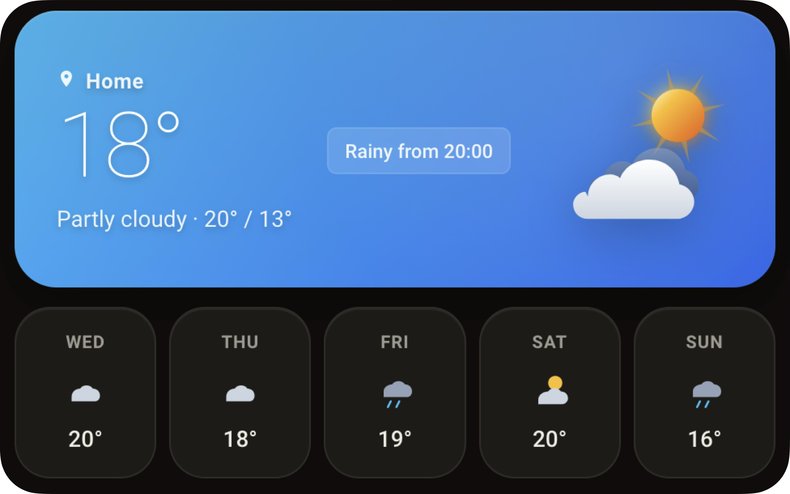

# Modern Weather Card

A modern & layered weather card for Home Assistant focusing on animated effects and time-of-day visuals, inspired by apps like Apple Weather.



## Features

- Layered architecture (Sky, Weather effects, Icon, Text)
- Astro time-of-day gradients
- Volumetric fog and layered snow effects
- Lightning flashes and rain splashes
- Dawn/dusk horizon motion
- Separated forecast entity support
- Native Home Assistant UI Editor support - no YAML necessary
- Standard tap actions
- Dynamic upcoming forecast hints

## Installation

### HACS (Custom Repository)

Until the card is available in the HACS default store, you can add it as a custom repository:

1. In HACS, open the menu (three dots in the top right) and select **Custom repositories**.
2. Add `https://github.com/mwckr/homassistant-modern-weather-card` with type **Dashboard**.
3. Search for **Modern Weather Card** in HACS and install it.
4. HACS registers the resource automatically. Reload your browser and dashboard.

### Manual Installation

1. Download `modern-weather-card.js` from the [`dist/`](dist/) folder of this repository (or from the latest release). Since v0.2.0 this is a single file — the visual editor is bundled in.
2. Create a folder named `modern-weather-card` inside your Home Assistant `config/www` directory. If you don't know how to access your files inside Home Assistant, check out the Studio Code Server Addon: `https://github.com/hassio-addons/addon-vscode`
   *(Note: if you don't have a `www` directory in your config folder, create one).*
3. Place the `.js` file into the newly created `/config/www/modern-weather-card/` folder.
4. Go to your Home Assistant dashboard, navigate to **Settings -> Dashboards -> Resources (three dots in the top right)**.
5. Click **Add Resource** and paste the following URL:
   `/local/modern-weather-card/modern-weather-card.js`
   *(Optional: If you are upgrading from an older version of the card, append the version number, for example `?v=0.2.0` at the end to try and bust the cache)*
6. Ensure the resource type is set to **JavaScript Module**.
7. Save, reload your browser and dashboard.

> **Upgrading from v0.1.x:** the separate `modern-weather-card-editor.js` file is no longer needed — the editor is now part of the main bundle. You can delete the old editor file from `/config/www/modern-weather-card/`.

## Configuration

Add the card to your dashboard. It can be configured via the visual UI editor or using YAML.

### YAML Variables

| Name | Type | Default | Description |
|------|------|---------|-------------|
| `entity` | string | **Required** | The primary weather entity block to track. |
| `name` | string | entity friendly name | Custom label for the location. Set to `""` to hide the location label entirely. |
| `show_forecast` | boolean | `true` | Display the multi-day forecast section. |
| `show_low_temp` | boolean | `false` | Display low temperatures in the forecast. |
| `show_no_temp` | boolean | `false` | Hide temperatures entirely from the forecast. |
| `forecast_days` | number | `5` | Define the number of days rendered in the forecast summary. |
| `sun_entity` | string | `sun.sun` | Entity used to determine time-of-day gradients. `sun.sun` is enabled by default in Home Assistant. This should help show sunset / night visuals depending on your location and season. |
| `time_format` | string | `default` | Override time display: `default` uses your Home Assistant user profile setting. Custom overrides with `12`, `24`, or `system` (browser/OS preference). |
| `alert_lookahead` | number | `12` | Hours ahead to scan for upcoming weather events (0-24, `0` disables the hint). |
| `forecast_entity` | string | `config.entity` | Separate entity to source the forecast array, if different from primary. |
| `tap_action` | object | `{ action: 'more-info' }` | Standard Home Assistant action triggered on physical tap/click. |

## Development

The card is written in TypeScript on [Lit](https://lit.dev) and bundled with Rollup into a single file at `dist/modern-weather-card.js`.

```bash
npm install        # install dependencies
npm run build      # type-check and bundle to dist/
npm run watch      # rebuild on change
npm run typecheck  # type-check only
```

`dev/preview.html` is a standalone preview harness with a mocked `hass` object that renders the card in a range of weather/time-of-day scenarios — no Home Assistant instance required. Serve the repository root (e.g. `python3 -m http.server`) and open `/dev/preview.html` in a browser.

Source layout:

```
src/
├── index.ts              # bundle entry: registers card, editor and customCards metadata
├── modern-weather-card.ts# main card component (Lit)
├── editor.ts             # visual editor (ha-form based)
├── styles.ts             # card styles
├── const.ts              # card metadata, condition maps
├── types.ts              # config and forecast types
├── format.ts             # locale-aware time/day formatting, custom strings
├── forecast-alert.ts     # upcoming-weather hint logic
├── weather-meta.ts       # condition -> icon/tint/scene mapping, sky palettes
└── svg/                  # deterministic SVG generators (hero icons, scene layers, forecast icons)
```
